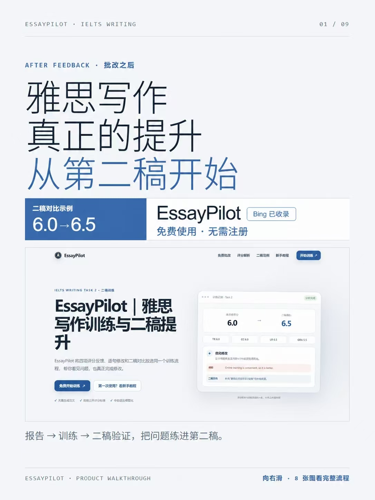
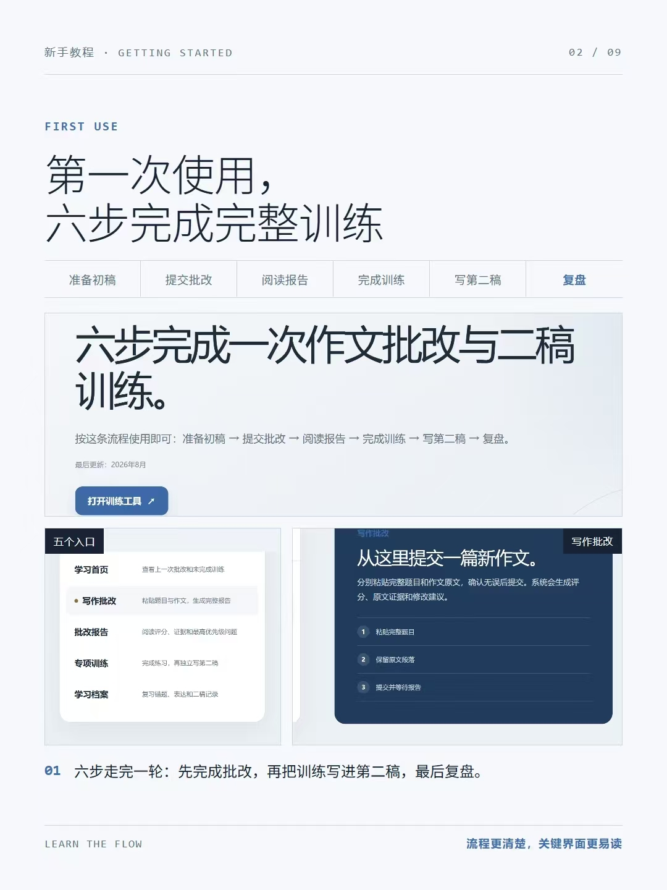
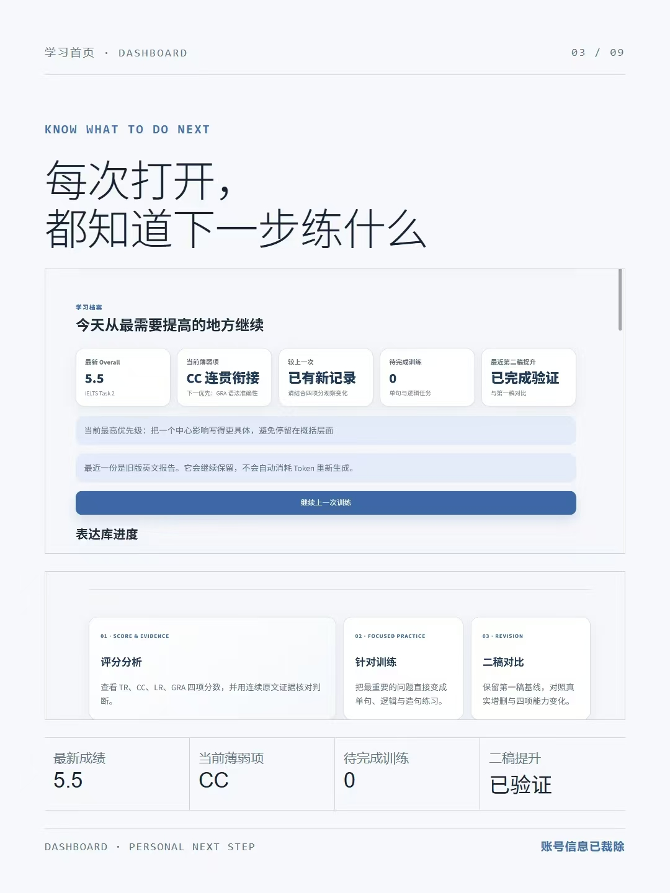
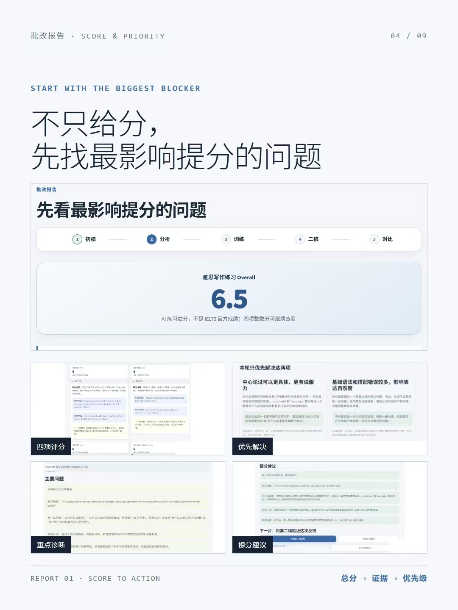
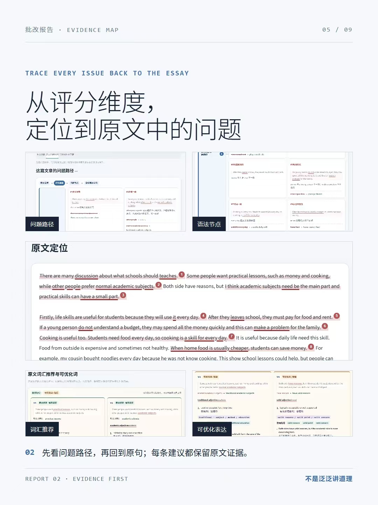
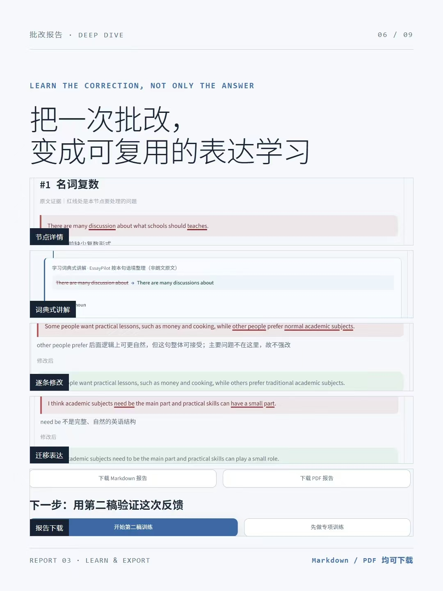
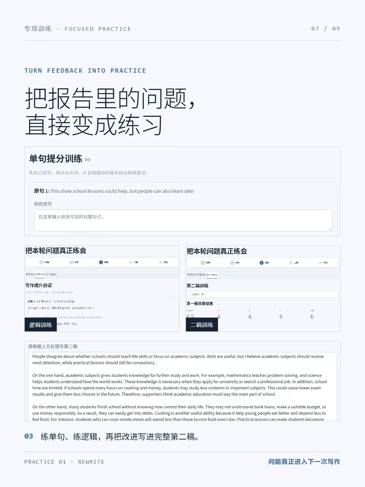
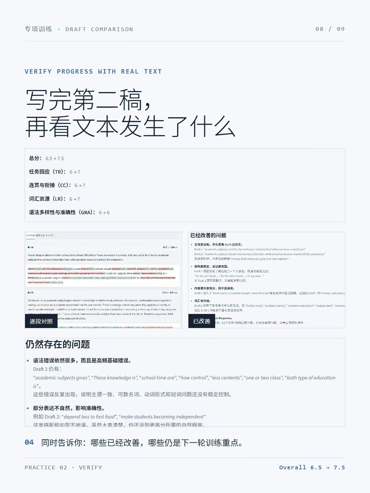
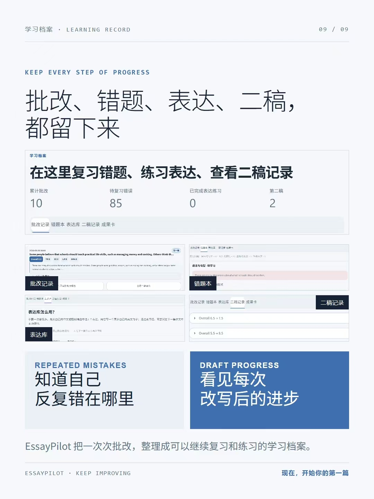
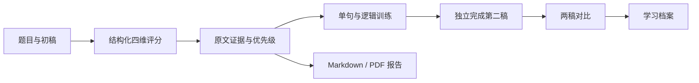

# EssayPilot｜雅思写作训练与二稿提升

<p align="center">
  <strong>把一次 AI 批改，变成真正能迁移到下一篇作文的训练。</strong>
</p>

<p align="center">
  <a href="https://essaypilot.cn/">产品官网</a> ·
  <a href="https://xbz4ydgw2t6cm2ytkh79vq.streamlit.app/">在线体验</a> ·
  <a href="https://github.com/tornado266/EssayPilot">GitHub 仓库</a>
</p>



EssayPilot 是一个面向中文学习者的 **IELTS Writing Task 2** 学习工作台。它不止返回一个估分或一篇“标准答案”，而是把完整学习过程串成一条清晰路径：

> 提交初稿 → 查看评分与原文证据 → 找到最影响提分的问题 → 完成单句和逻辑训练 → 写第二稿 → 对比进步 → 沉淀学习档案

当前版本固定使用 `gpt-5.4-mini` 进行评分与教学反馈，以减少频繁切换模型带来的标准漂移。所有分数均为 AI 练习估分，**不是 IELTS 官方成绩**。

## 为什么做 EssayPilot

很多写作批改工具停在“指出问题”这一步：学生看懂了反馈，却不知道下一步该练什么，也很难确认第二稿是否真的进步。

EssayPilot 把重点放在反馈之后：

- **先找最大阻点**：按 TR、CC、LR、GRA 四项维度评分，并优先呈现最影响下一档分数的问题。
- **每条判断都有证据**：从评分维度回到原文中的具体句子，不用泛泛的模板化建议代替诊断。
- **把问题直接变成练习**：针对单句表达、段落逻辑和整篇第二稿分别训练。
- **用第二稿验证反馈**：比较两稿分数、已经改善的问题、仍然存在的问题和下一轮优先级。
- **留下可复习的资产**：保存批改记录、错题、表达练习和二稿变化，逐步形成个人学习档案。

## 核心能力

| 模块 | 你会得到什么 |
| --- | --- |
| 四维评分 | Task Response、Coherence & Cohesion、Lexical Resource、Grammatical Range & Accuracy 四项估分与依据 |
| 重点诊断 | 本轮最值得优先解决的 1–2 个问题，以及可执行的修改方向 |
| 原文问题地图 | 把语法、词汇、衔接和表达问题定位回原文，保留上下文证据 |
| 学习词典式讲解 | 针对问题节点解释替换词、搭配和更自然的表达，而不是只给答案 |
| 专项训练 | 单句改写、逻辑展开和反馈后的再次修改 |
| 第二稿对比 | 对照两稿的四项分数、已改善问题、残留问题与下一轮训练重点 |
| 学习档案 | 汇总历史批改、错题本、表达库、二稿记录和进步趋势 |
| 报告导出 | 登录后可下载 Markdown 与排版后的中文 PDF 报告 |

## 第一次怎么用

1. 在“写作批改”中粘贴完整的 Task 2 英文题目和作文原文。
2. 提交批改，先看 Overall 与四项分数，再看最影响提分的问题。
3. 打开“原文问题地图”，确认每条反馈对应的原句和具体证据。
4. 进入“专项训练”，先改句子、补逻辑，再独立完成整篇第二稿。
5. 提交第二稿，查看两稿变化和下一轮优先级。
6. 在“学习档案”中复习反复出现的错误、积累表达并追踪进步。

在线版允许当前浏览器的访客免费生成 1 次首稿完整报告；登录后可以保存、下载报告，并在不同设备间同步学习记录。AI 专项训练和第二稿验证属于 3 篇训练包权益。本地运行时，数据也可以只保存在当前电脑。

每个账号的创始体验首包为 **¥7.5 / 30 天 / 3 篇**；首包用完或到期后，后续每个 3 篇续包为 **¥9.9 / 30 天 / 3 篇**，可重复购买。每篇含 1 份首稿报告、最多 3 次专项 AI 点评和 1 次二稿评分与两稿对比；30 天与 3 篇任一先达到即结束。所有套餐都不自动续费，当前采用支付订单号人工核对，开通时间以审核通过时为准。当前包仍有可用篇数或存在处理中请求时，系统不会接受下一包申请。

## 完整产品导览

<details>
<summary><strong>01–03｜从第一次使用到个人学习首页</strong></summary>

### 六步完成一次训练



### 每次打开都知道下一步练什么



</details>

<details>
<summary><strong>04–06｜从分数回到原文证据</strong></summary>

### 不只给分，先找最影响提分的问题



### 从评分维度定位到原文中的问题



### 把一次批改变成可复用的表达学习



</details>

<details>
<summary><strong>07–09｜专项训练、二稿验证与长期记录</strong></summary>

### 把报告里的问题直接变成练习



### 用真实第二稿检查是否进步



### 把每次修改留在学习档案里



</details>

## 工作原理



评分阶段和教学反馈阶段相互分离：模型先按固定结构返回评分决定，程序再校验证据、字段和分数计算；验证通过后才生成中文诊断与训练内容。相同题目和作文可以复用已有结果，避免重复消耗 Token。

## 技术栈

| 层级 | 技术 |
| --- | --- |
| 界面 | Streamlit |
| AI | OpenAI Python SDK + 固定 `gpt-5.4-mini` 模型快照 |
| 数据可视化 | Altair、pandas |
| 报告导出 | ReportLab + 内置 Noto Sans SC 字体 |
| 云端账户与数据 | Supabase Auth / Postgres / Row Level Security |
| 本地存储 | Markdown、JSON 文件 |

## 本地运行

### 1. 克隆仓库

```bash
git clone https://github.com/tornado266/EssayPilot.git
cd EssayPilot
```

### 2. 创建虚拟环境

Windows PowerShell：

```powershell
python -m venv .venv
.\.venv\Scripts\Activate.ps1
```

macOS / Linux：

```bash
python -m venv .venv
source .venv/bin/activate
```

### 3. 安装依赖

```bash
pip install -r requirements.txt
```

### 4. 配置环境变量

复制 `.env.example` 为 `.env`，至少填写 OpenAI API Key：

```dotenv
OPENAI_API_KEY=your_openai_api_key
```

如果只在本地使用，到这里就可以启动。若需要邮箱验证码登录、跨设备同步和云端学习档案，再配置：

```dotenv
SUPABASE_URL=https://your-project.supabase.co
SUPABASE_ANON_KEY=your_publishable_anon_key
ALLOW_LOCAL_UNMETERED_AI=false
```

新建 Supabase 项目时，在 SQL Editor 中运行 `supabase/schema.sql`。已有项目应按文件名顺序执行
`20260901_founder_membership.sql`、`20260901120000_guest_trial_idempotency.sql`、
`20260901130000_second_draft_idempotency.sql` 和
`20260901140000_membership_renewal_packs.sql`。应用会优先读取 Streamlit Secrets，再回退到本地环境变量。

如需开放首包与续包，先完成数据库升级，再同时配置 `FOUNDER_PAYMENT_INSTRUCTIONS`、`FOUNDER_SUPPORT_CONTACT` 与 `FOUNDER_REFUND_POLICY`；缺少任一项时，应用只展示套餐说明，不接受付款核对申请。`FOUNDER_PAYMENT_QR_URL` 可按实际收款方式选配。客户端不提交或决定套餐价格：服务端根据账号的已核销购买记录确定本次是 ¥7.5 首包还是 ¥9.9 续包。人工审批入口为管理员登录后的 `?admin=1` 页面。

“当前浏览器免费 1 次”依赖浏览器本地身份，只是一层低摩擦体验限制，不是可靠的反滥用边界。公开引流前还应在部署入口配置 CAPTCHA、来源限速或等价的服务端成本上限。

### 5. 启动应用

```bash
streamlit run app.py
```

浏览器打开 `http://localhost:8501`。

## 可选配置

| 变量 | 是否必需 | 用途 |
| --- | --- | --- |
| `OPENAI_API_KEY` | 是 | 作文评分、训练反馈与二稿对比 |
| `SUPABASE_URL` | 公开部署必填 | Supabase 项目地址；缺失时默认拒绝 AI 请求 |
| `SUPABASE_ANON_KEY` | 公开部署必填 | 登录、用户侧数据和服务端额度校验；缺失时默认拒绝 AI 请求 |
| `ALLOW_LOCAL_UNMETERED_AI` | 否 | 仅供本机开发显式设为 `true`；Supabase 缺失时允许不计额度的模型调用，公开部署严禁开启 |
| `SUPABASE_SECRET_KEY` | 否 | 服务端聚合数据接口；必须仅保存在服务端 |
| `ADMIN_EMAILS` | 否 | 管理员邮箱白名单，多个邮箱用逗号分隔 |
| `ADMIN_PASSWORD` | 否 | 未配置邮箱白名单时的管理页备用验证 |
| `BETA_START_AT` | 否 | 公测统计的起始时间 |
| `FOUNDER_PAYMENT_QR_URL` | 否 | 可选的首包/续包收款二维码图片地址；也可以只在付款说明中提供收款方式 |
| `FOUNDER_PAYMENT_INSTRUCTIONS` | 否 | 用户可见的付款与人工核对说明 |
| `FOUNDER_SUPPORT_CONTACT` | 否 | 核对、退款和异常处理的真实联系方式 |
| `FOUNDER_REFUND_POLICY` | 否 | 用户可见的退款与未使用权益说明 |

不要提交 `.env` 或 `.streamlit/secrets.toml`，也不要把 Supabase 服务端密钥暴露给浏览器。

## 部署到 Streamlit Community Cloud

1. Fork 本仓库，或把代码推送到自己的 GitHub 仓库。
2. 在 Streamlit Community Cloud 新建应用。
3. 选择 `main` 分支，并把入口文件设为 `app.py`。
4. 在应用的 Secrets 中配置 `OPENAI_API_KEY`；需要云端学习档案时，再加入 Supabase 变量。
5. 部署后完成一篇测试作文，检查评分、专项训练、二稿与下载流程。

## 项目结构

```text
EssayPilot/
├─ app.py                  # 页面路由与主要交互
├─ src/                    # 评分、报告、训练、存储与学习资产
├─ ui/                     # 可复用界面组件
├─ styles/                 # 页面样式
├─ skills/ielts-writing/   # IELTS 评分与反馈规则
├─ data/                   # 示例报告、题库与公开校准元数据
├─ supabase/               # 数据库结构和迁移脚本
├─ screenshots/            # README 产品图片
├─ tests/                  # 离线测试
├─ requirements.txt
└─ .env.example
```

## 测试与评分校准

离线测试不会调用模型 API：

```bash
python -m unittest discover -s tests -v
```

需要真实 API 的重复性校准必须显式执行，并会产生费用：

```bash
python -m scripts.run_calibration --repeats 3 --provider OpenAI --model gpt-5.4-mini-2026-03-17
```

私有校准作文、运行结果和 Kaggle 原始数据应始终放在已忽略的 `.private/` 或本地原始数据目录中。公开仓库只保留必要的案例 ID、哈希、数量和分数分布，不应包含私有作文正文。

## 数据与隐私

- API Key 只从 Streamlit Secrets 或环境变量读取，不会写入批改报告。
- 未配置 Supabase 时，记录保存在本机；部署在 Streamlit Community Cloud 上的本地文件可能随实例重启而清除。
- 配置 Supabase 后，作文、报告、练习和二稿记录受行级安全策略保护，仅对应用户可访问。
- 私有管理页的产品统计区只返回匿名聚合数据；单独的人工付款审核区仅向管理员白名单开放，并只显示核单所需的账号与订单信息，不显示作文正文或报告内容。
- AI 评分存在波动，更适合观察多次练习的趋势，而不是替代官方考试成绩。

## 当前范围

- 当前仅支持 **IELTS Writing Task 2**，Task 1 尚未开放。
- 产品面向学习与自我训练，不提供官方 IELTS 成绩认证。
- 仓库中的 Noto Sans SC 字体遵循 SIL Open Font License 1.1，详见 `assets/fonts/README.md`。

如果 EssayPilot 对你的写作训练有帮助，欢迎提交 Issue、改进建议或 Pull Request。
