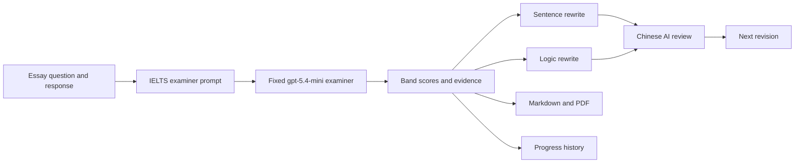

# EssayPilot

### AI-assisted IELTS Writing feedback, revision, and progress tracking

[Open the live app](https://xbz4ydgw2t6cm2ytkh79vq.streamlit.app/) | [View the repository](https://github.com/tornado266/EssayPilot)

EssayPilot is a Streamlit learning workspace for IELTS Writing Task 2. It uses a fixed `gpt-5.4-mini` examiner, deterministic band calculation, evidence-based feedback, guided rewriting, second-draft comparison, and an optional cloud learning profile.

EssayPilot supports a private developer dashboard for the public-beta learning funnel. Access is protected by `ADMIN_PASSWORD`; its service-role query returns anonymous counts only and never returns email addresses, essay text, or reports.

> EssayPilot is a practice tool, not an official IELTS score report.


## Product Highlights

- **Four-criterion scoring** for Task Response, Coherence and Cohesion, Lexical Resource, and Grammatical Range and Accuracy.
- **Strength-and-weakness evidence** for every criterion, grounded in the student's own writing.
- **Active rewriting practice** at both sentence and paragraph-logic level; students write before receiving feedback.
- **Chinese coaching feedback** that explains what improved, what remains weak, and how to reach Band 6.5+.
- **Band 7 reference material** including improved language, useful expressions, and model rewrites.
- **Markdown and polished PDF export** containing the question, original essay, score, and complete feedback.
- **Progress tracking** with a fixed 3-9 IELTS band chart for recent saved attempts.

## Product Tour

### 1. Score overview

The report begins with the estimated overall band and a separate score card for each IELTS criterion.


### 2. Criterion-level diagnosis

Each IELTS criterion can be expanded independently. The dashboard separates evidence that helps the score from the main issue that limits the next band.


### 3. Full examiner feedback

Detailed feedback is kept in a collapsible report so the dashboard remains easy to scan while preserving the complete analysis.


### 4. A workspace that moves from report to practice

The report, sentence practice, logic check, and score history are separate collapsible areas. Students can focus on one learning task at a time while the progress chart keeps recent attempts comparable on a fixed 3-9 band scale.


### 5. Sentence-level score improvement

EssayPilot extracts weak sentences and asks the student to rewrite them. A reference answer is available, but the main workflow encourages the student to attempt the correction first.


After submission, the AI gives concise Chinese feedback, an estimated level, a more natural Band 6.5-7 version, and reusable language patterns.


### 6. Logic and paragraph development

The logic check targets higher-level problems such as vague claims, shallow explanation, unsupported examples, and weak paragraph progression. Each task includes the original passage and a concrete rewriting constraint.


The comparison step checks whether the rewrite is clearer and closer to Band 6.5+. If the student submits an incomplete rewrite, the system explains why the logic cannot yet be evaluated.


It then converts the weakness into a practical rewrite plan: retain the claim, deepen the explanation, strengthen the example, and reconnect the paragraph to the position.


### 7. Downloadable learning record

Every completed correction can be exported as Markdown or as a styled, bilingual PDF report.


## How It Works



The examiner must satisfy a strict JSON schema. EssayPilot verifies exact essay evidence, calculates the overall band from the four whole-band criteria, and saves a report only after validation succeeds.

## Feedback Workflow

1. Paste the IELTS Writing Task 2 question.
2. Paste the student's essay and review the word count.
3. Run the fixed Task 2 examiner.
4. Review the overall band and four criterion scores.
5. Expand criterion details to compare strengths with the main score-limiting issue.
6. Read the full report for evidence, corrections, and improvement priorities.
7. Rewrite selected weak sentences and request targeted Chinese feedback.
8. Rewrite a key paragraph to improve claim, explanation, example, and progression.
9. Review the comparison feedback and revise again when needed.
10. Export the complete learning record as Markdown or PDF.

## Learning Design

EssayPilot follows a short deliberate-practice loop:

1. **Diagnose:** identify the criterion and the exact sentence or paragraph holding the score back.
2. **Rewrite:** require the student to produce a new version instead of passively reading corrections.
3. **Compare:** evaluate the rewrite against the original and a Band 6.5-7 target.
4. **Transfer:** extract a reusable sentence pattern or paragraph strategy for the next essay.

This keeps the examiner report useful without turning the product into a one-click essay replacement tool.

## Tech Stack

| Layer | Technology |
| --- | --- |
| UI | Streamlit |
| AI provider | OpenAI `gpt-5.4-mini` (fixed for scoring consistency) |
| Provider client | OpenAI Python SDK with configurable base URL |
| Charts | Altair and pandas |
| Report export | ReportLab with an embedded Noto Sans SC font |
| Persistence | Supabase Auth/Postgres, with local Markdown/JSON fallback |

## Quick Start

### 1. Clone the repository

```bash
git clone https://github.com/tornado266/EssayPilot.git
cd EssayPilot
```

### 2. Create and activate a virtual environment

Windows PowerShell:

```powershell
python -m venv .venv
.\.venv\Scripts\Activate.ps1
```

macOS or Linux:

```bash
python -m venv .venv
source .venv/bin/activate
```

### 3. Install dependencies

```bash
pip install -r requirements.txt
```

### 4. Configure scoring and optional cloud profiles

Create a local `.env` file:

```dotenv
OPENAI_API_KEY=your_openai_api_key

# Optional: enables email-code login and cross-device records
SUPABASE_URL=https://your-project.supabase.co
SUPABASE_ANON_KEY=your_publishable_anon_key

# Optional: enables the private aggregate beta dashboard
SUPABASE_SERVICE_ROLE_KEY=your_private_service_role_key
BETA_START_AT=2026-08-09T17:00:00+08:00
ADMIN_PASSWORD=choose_a_private_dashboard_password
```

The app reads Streamlit Secrets first and falls back to environment variables for local development.
For cloud profiles, create a Supabase project and run `supabase/schema.sql` once in its SQL editor. Row-level security restricts every essay, report, practice attempt, draft revision, and learning item to its owner.

If the original schema was already installed, run only `supabase/migrations/20260809_learning_items.sql` to enable the cloud error book and reusable learning assets. New projects can run the complete `supabase/schema.sql` directly.

For the topic-based expression library upgrade, existing projects must also run
`supabase/migrations/20260809_expression_library.sql`. It makes catalog expressions
optional personal assets, adds favorites and topic/function metadata, and creates the
RLS-protected expression-attempt history. Static catalog browsing never writes rows or
calls the model.

### 5. Run EssayPilot

```bash
streamlit run app.py
```

Then open `http://localhost:8501`.

## Deploy on Streamlit Community Cloud

1. Fork or push the repository to GitHub.
2. Create a new app in [Streamlit Community Cloud](https://share.streamlit.io/).
3. Select the `main` branch and `app.py` entrypoint.
4. Add provider credentials under **App settings > Secrets**:

```toml
OPENAI_API_KEY = "your_openai_api_key"
SUPABASE_URL = "https://your-project.supabase.co"
SUPABASE_ANON_KEY = "your_publishable_anon_key"
SUPABASE_SERVICE_ROLE_KEY = "your_private_service_role_key"
BETA_START_AT = "2026-08-09T17:00:00+08:00"
ADMIN_PASSWORD = "choose_a_private_dashboard_password"
```

Never commit `.env` or `.streamlit/secrets.toml`. `SUPABASE_SERVICE_ROLE_KEY` must stay server-side. The dashboard is available at `?admin=1` and remains disabled if either its private key or beta start time is missing; normal grading is unaffected.

## Project Structure

```text
EssayPilot/
|-- app.py                    # Streamlit presentation layer
|-- requirements.txt
|-- assets/                   # Background and embedded PDF font
|-- screenshots/              # README product screenshots
|-- records/                  # Local correction history
|-- supabase/schema.sql       # Cloud tables, transaction function, and RLS policies
|-- tests/                    # Offline scoring-contract tests
`-- src/
    |-- ai_grader.py          # Provider configuration and requests
    |-- prompts.py            # IELTS examiner and rewrite prompts
    |-- result_parser.py      # Defensive structured parsing
    |-- storage.py            # Markdown, JSON, and PDF exports
    |-- error_book.py         # Error-book generation
    `-- text_utils.py
```

## Data and Deployment Notes

- API keys are loaded from Streamlit Secrets or local environment variables and are never written into report files.
- Local fallback records on Streamlit Community Cloud are ephemeral and may be cleared when the app restarts.
- When Supabase is configured, authenticated learning records persist across restarts and devices. Existing local records are never uploaded automatically.
- AI scoring is probabilistic. Use repeated practice and criterion trends rather than treating one result as an official score.

## Scoring calibration

Offline contract tests never call the API:

```bash
python -m unittest discover -s tests -v
```

The repeatability runner uses paid API calls and checks every score's spread against the 0.5-band tolerance:

```bash
python -m scripts.run_calibration --repeats 3
```

## License

This repository is intended for learning, portfolio demonstration, and IELTS writing practice. The bundled Noto Sans SC font is distributed under the SIL Open Font License 1.1.
